# Fresh-install alert audit — 12 August 2026

## Result

**Failed: native failure alerts are readily reproducible in ordinary first-run use.** I used a brand-new iPhone 17 Pro Max (iOS 26.2) simulator, installed the current Debug build with no app cache or saved state, and used it as a normal person would. The app displayed alerts in first launch, Saved Places, Map, Find Sun, location-denied, search, and tapped-place journeys.

The fresh simulator used a simulated London coordinate after location permission was granted. Every WeatherKit request in this clean environment reached its final failure state after the app's retry behaviour, so this is especially important as a cold-start test. A warm existing simulator may mask it with cached data; the alert behaviour here is still user-visible on a genuinely new install.

Test device left open: **Weather Atlas Alert Audit — iOS 26.2**.

## Reproduced alerts

### 1. First launch with location allowed — P0

**Steps:** Fresh install → `Use Current Location` → allow while using app → simulated London location resolves.

**Observed:** `Weather Data Missing` → “Weather data is missing for City of Westminster because the request failed.”

The first screen ends in an alert rather than a usable local forecast or a quiet inline unavailable state.

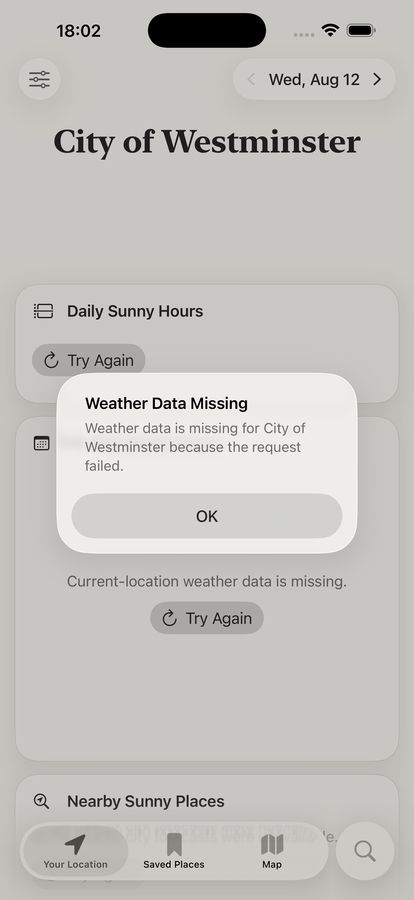

### 2. Default Saved Places — P0

**Steps:** Fresh install → open Saved Places after its supplied default places load.

**Observed:** One native batch alert names many default places whose weather requests failed, including Beijing, Cairo, Dubai, Istanbul, Johannesburg, London, Mexico City, and Mumbai.

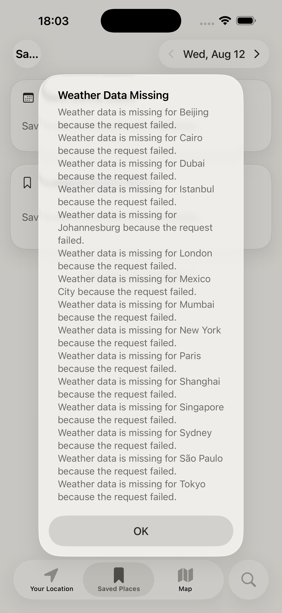

### 3. Entering Map adds further alerts — P0

**Steps:** From the same clean run → open Map.

**Observed:** Map generated a single-place “London” request-failure alert, then a second batch alert. The batch copy starts with a blank place name: “Weather data is missing for **, Beijing, and Cairo and 13 more places** …”.

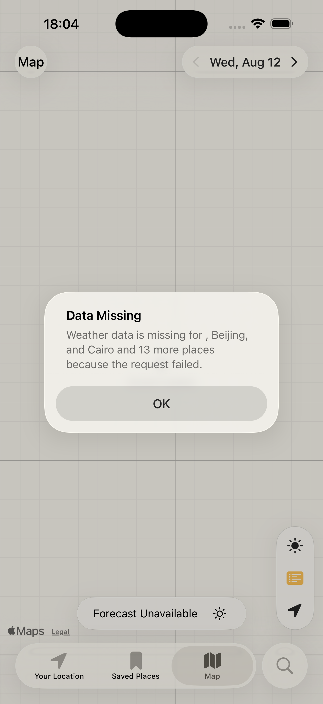

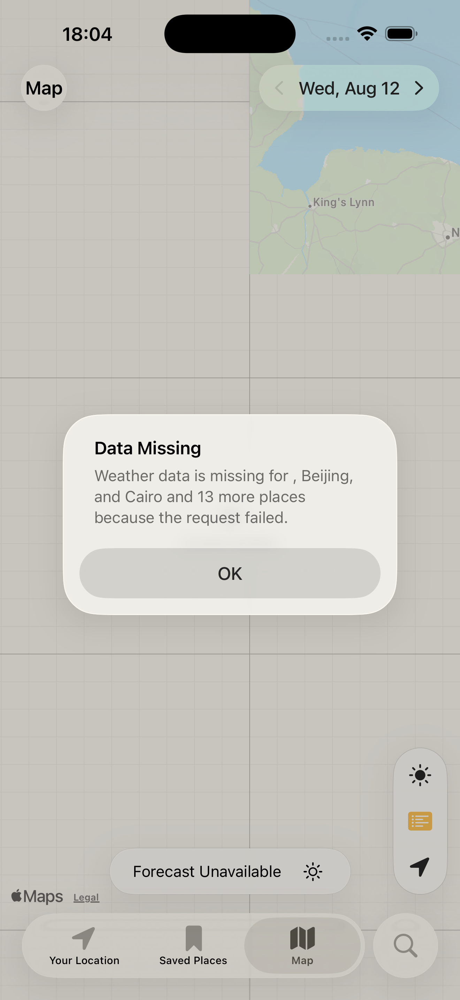

### 4. Find Sun: visible area, Near Me, and country — P0

**Steps:** Open Map → Find Sun → run each of these normal scopes:

- `This Area`
- `Near Me` (with location permitted)
- `Country` → United Kingdom

**Observed:** Each operation eventually presents a native batch failure alert instead of a quiet empty/unavailable result.

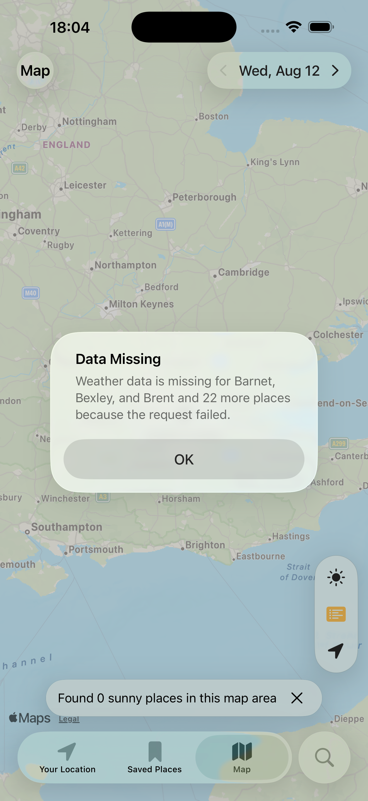

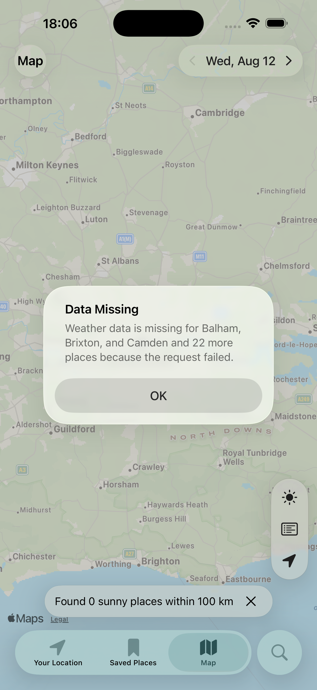

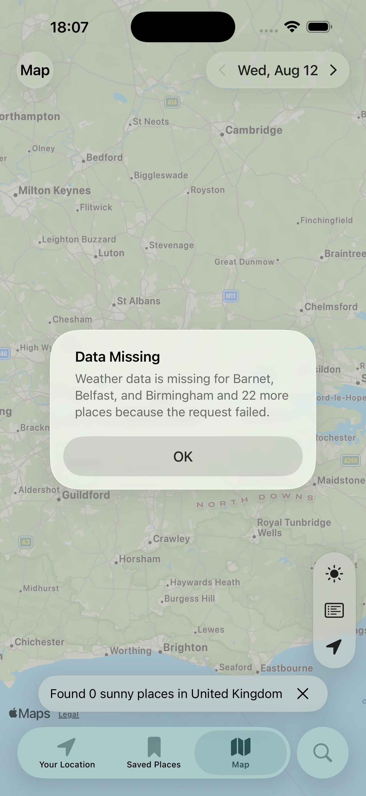

### 5. Location permission denied, then Near Me selected — P1

**Steps:** Revoke location permission on the isolated test device → open Map → Find Sun → select `Near Me`.

**Observed:** Selecting the scope alone shows `Data Missing` → “Current location data is missing.” The subsequent `Search Near Me` button is already disabled, so this should be an inline/disabled-state outcome rather than an alert.

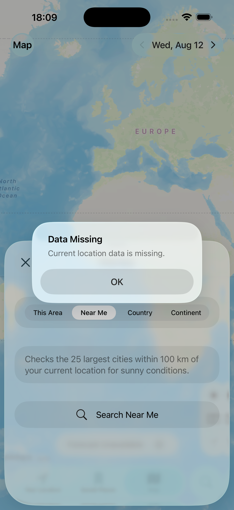

### 6. Valid Kiritimati search result cannot be opened — P1

**Steps:** Global Search → `Kiritimati` → choose the visible Apple Maps result “Kiritimati, Line Islands, Kiribati.”

**Observed:** `Search Data Missing` → “City name data is missing for Kiritimati.” The alert contradicts the result label, which already clearly gives the city name.

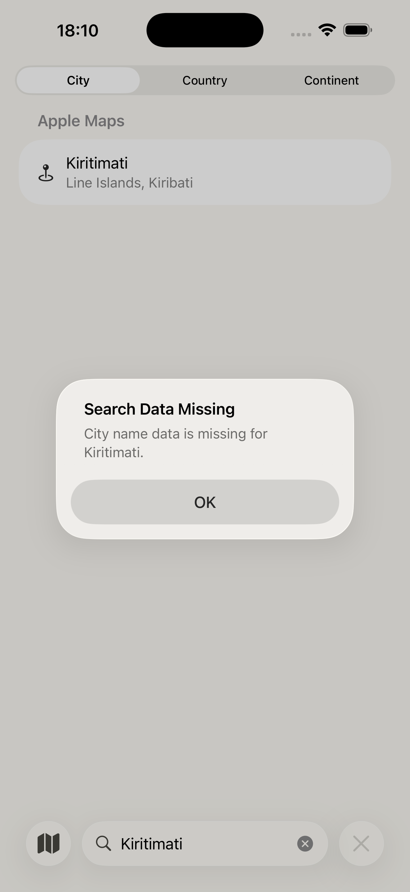

### 7. Tapped-place detail produces an alert cascade — P0

**Steps:** Map with no location → tap the map centre (resolved as Krachi Nchumuru, Ghana) → `View Details`.

**Observed:** One action creates two sequential alerts:

1. `Weather Data Missing` → “Missing forecast data for Krachi Nchumuru.”
2. After dismissing it, `Weather Data Missing` → “Weather data is missing for Krachi Nchumuru because the request failed.”

Tapping the detail screen's `Try Again` repeats the first alert. This is the clearest reproduction of an alert queue/cascade from one underlying failure.

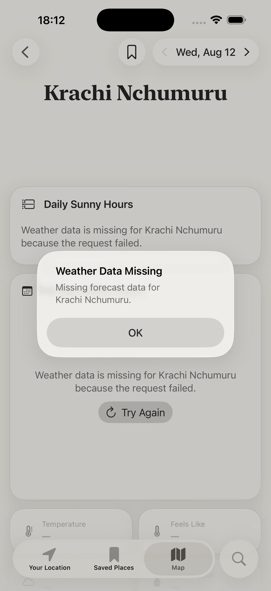

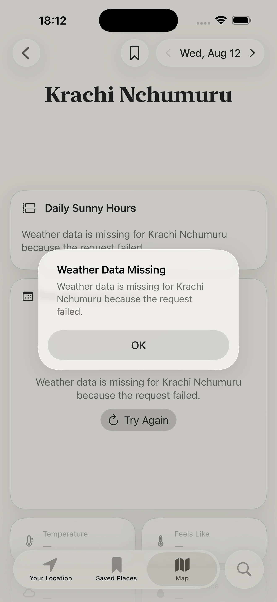

## Non-alerting checks that passed

- A nonsense city query (`xzzqzzq`) showed the intended inline `No Results` state without an alert.
- On the Your Location tab, denied location permission showed an inline explanation with `Open Settings`; it did not itself alert.
- A Longyearbyen Apple Maps result returned to Map without a native alert in this run.

## Patterns to keep in mind for the later fix pass

- A clean weather request failure currently becomes a user-facing native alert in multiple independent routes.
- The same root failure can be reported by a screen and a second Map/detail observer, creating a queue of alerts.
- Expected user states (permission denied, no results, unavailable forecast) already have viable inline UI in several places; they should not additionally escalate to native alerts.
- Resolver failures need to respect factual data already shown in the selected search result (Kiritimati is the clearest example).

For the product policy you described, these alerts should remain diagnostic-only in logs/developer tooling. The user-facing result after the bounded retry should stay blank or show the relevant inline unavailable/retry state, with no native alert.
