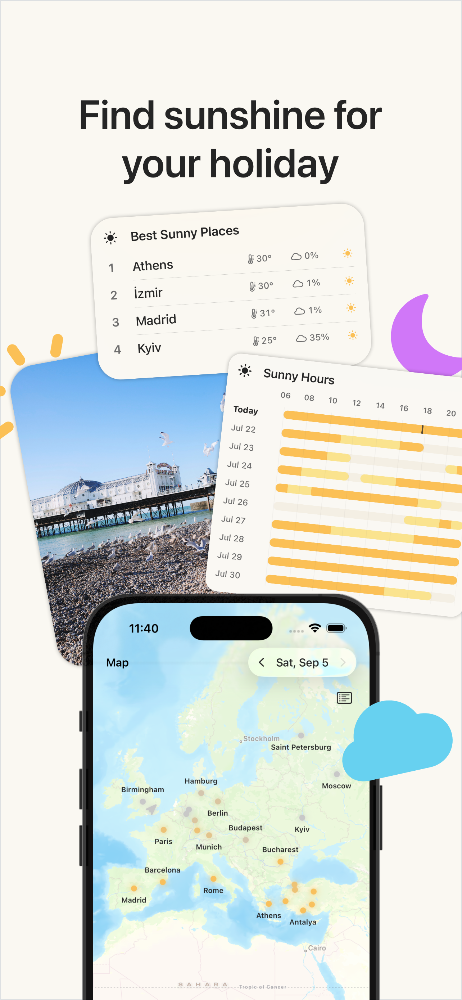
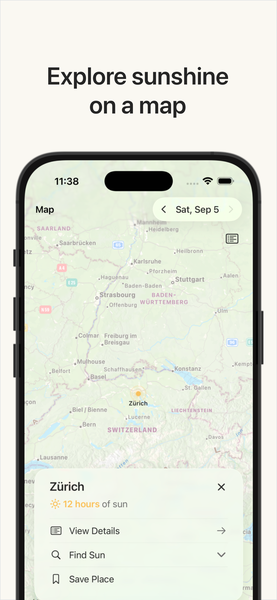
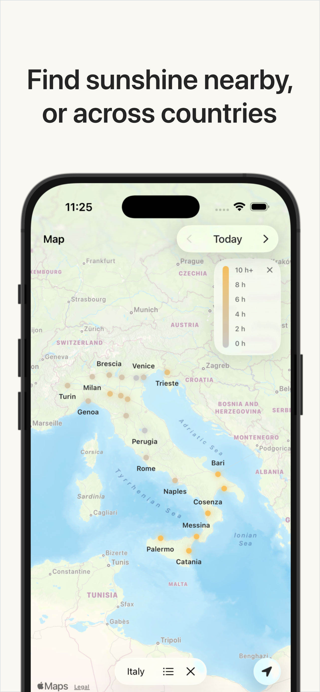
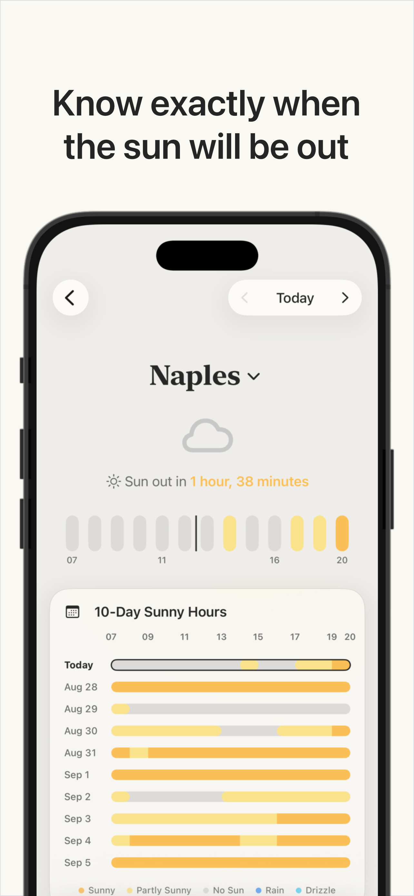
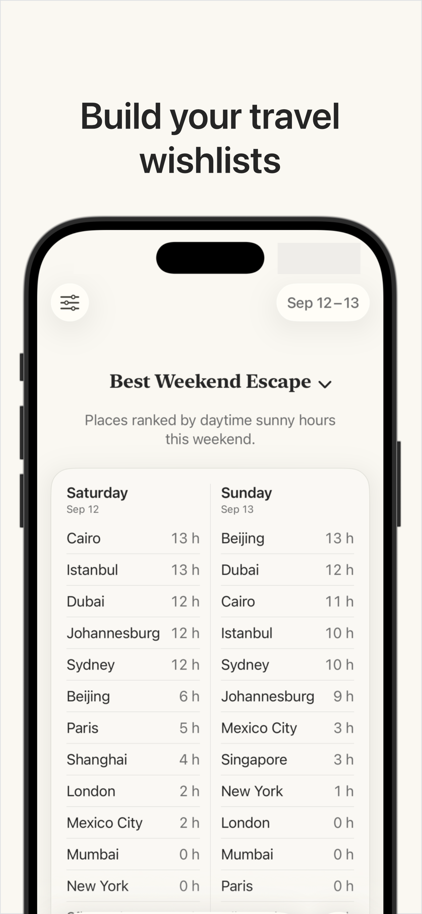
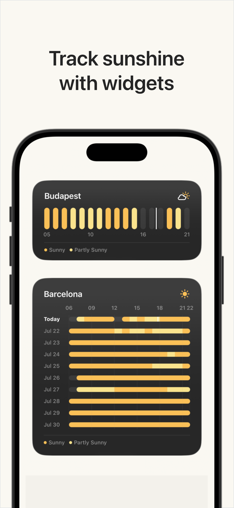

  

# Weather Atlas

**Compare destinations by sunshine, not just by temperature or rain.**

Weather Atlas is a native iPhone and iPad app for planning around sunny weather. Instead of opening forecasts city by city, you can save the places you care about and compare their daytime sunny hours for a date, a weekend, or the next reliably sunny day.

  
  
  

  
  
  

## Why Weather Atlas?

Conventional weather apps are good at answering “What will the weather be here?” Travel planning often starts with a different question: “Which of these places will be sunnier when I am free?”

Weather Atlas makes that comparison the main experience. It turns hourly forecasts into clear sunny-hour timelines, ranks saved destinations, and shows nearby alternatives when somewhere else has a brighter forecast.

## Technology

- Swift and SwiftUI
- WeatherKit
- MapKit
- Core Location
- WidgetKit and App Intents
- Swift Observation and structured concurrency
- [`SwiftTimeZoneLookup`](https://github.com/patrick-zippenfenig/SwiftTimeZoneLookup)

The app targets **iOS 18 and later**. Newer visual features such as Liquid Glass are adopted when available, with native material-based presentation retained on iOS 18.

## Project structure

| Path | Responsibility |
| --- | --- |
| `Weather/App` | App lifecycle, root navigation, deep links, and system integration |
| `Weather/Models` | Forecast, place, weather-condition, and sunny-hour domain models |
| `Weather/Helpers` | Persistence, WeatherKit access, location, caching, theming, and localization |
| `Weather/Views` | Your Location, Saved Places, Map, Search, Detail, Settings, and tutorial UI |
| `Weather/Widgets` | WidgetKit extension, configuration intents, timelines, and widget layouts |
| `Weather/Resources` | App icons and bundled place catalogs |

For a guided source tour, see [CODE_ORGANIZATION.md](CODE_ORGANIZATION.md). Resource ownership and localization details are documented in [PROJECT_RESOURCES_GUIDE.md](PROJECT_RESOURCES_GUIDE.md).

## Data and attribution

Weather data is provided by Apple Weather, and maps are provided by Apple Maps. The bundled geographic datasets incorporate public data from [SimpleMaps](https://simplemaps.com/), [GeoNames](https://www.geonames.org/), and [Open-Meteo](https://open-meteo.com/).

See [ThirdPartyNotices.txt](Weather/ThirdPartyNotices.txt) for dependency and dataset notices.

## Project status

Weather Atlas is an actively developed personal project focused on making sunny-day and short-trip planning faster, clearer, and more visual.
